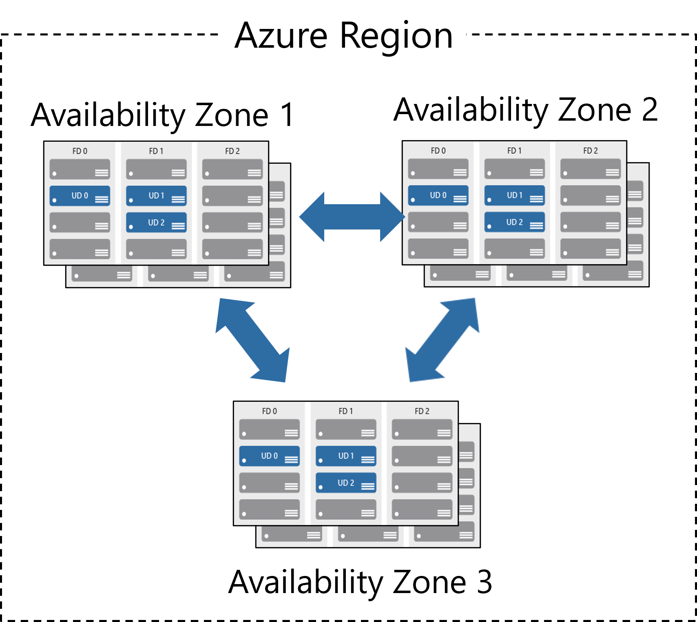

# Regions

Azure offers more global regions than any other cloud provider with 60+ regions representing over 140 countries.

* Regions are made up of one or more datacenters in close proximity.
* Offering customers the ability to adjust their resources and capacity as needed, so their users experience faster response times when accessing their applications or data.
* Provides options for businesses to store their data in specific places, ensuring they meet rules about where data can be kept, all while offering a range of tools to help businesses comply with various regulations.

## Region Pairs

It's like having a backup location for your data in case something goes wrong with the main location. Each region pair consists of two regions.

* At least 300 miles of separation between region pairs.
* Automatic replication for some services.
* If there is a disruption or failure in one region, Azure will prioritize restoring services and data in a structured way to ensure the most critical regions are recovered first. This helps get essential services back online more quickly and efficiently.
* Instead of updating all regions at once, updates are applied one after the other. This approach reduces the risk of widespread downtime because only a small part of the system is updated at any given time. If an issue arises, it can be addressed before affecting other regions, ensuring smoother and more reliable updates

## Availability Zones

Availability Zones are like having multiple, separate backup locations within the same area, each with its own power, cooling, and internet, all connected by super-fast, private internet lines.

* Distributing your applications and data across multiple zones, you ensure that if one datacenter goes down, your services can continue running from the other zones.
* Availability Zones are distinct physical locations within an Azure region, ensuring geographical separation to minimize risks.
* An issue in one datacenter, like a power outage or network failure, won’t affect the others.
* High-speed private connections between zones allow for low-latency data replication and synchronization, ensuring seamless performance and quick failover in case of an issue.

# Azure Resources

Azure resources are components like storage, virtual machines, and networks that are available to build cloud solutions.
## Resource Group

A resource group is a container to manage and aggregate resources in a single unit.

* Resources can exist in only one resource group.
* Resources can exist in different regions.
* Resources can be moved to different resource groups.
* Applications can utilize multiple resource groups.
## Azure Resource Manager

The Azure Resource Manager (ARM) provides a management layer that enables you to create, update, and delete resources in your Azure subscription.

## Azure Subscriptions

