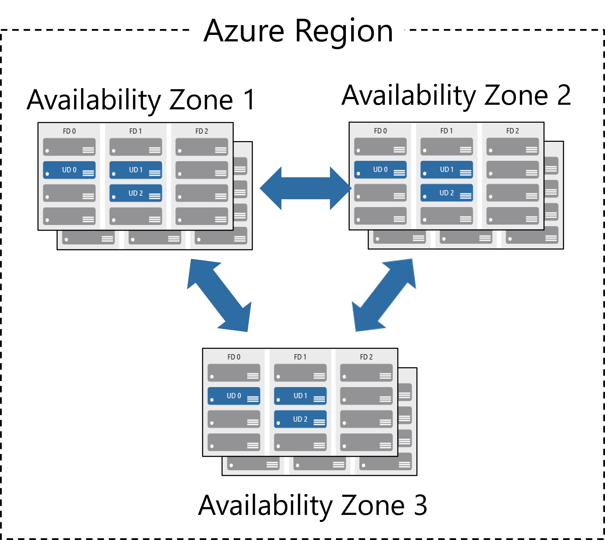
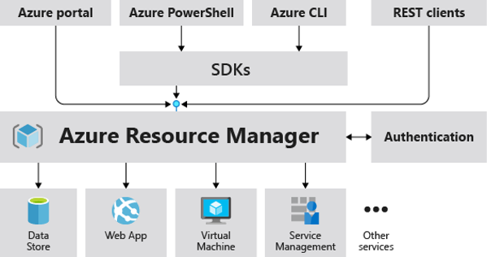

# Regions

Azure offers more global regions than any other cloud provider with 60+ regions representing over 140 countries.

* Regions are made up of one or more datacenters in close proximity.
* Offering customers the ability to adjust their resources and capacity as needed, so their users experience faster response times when accessing their applications or data.
* Provides options for businesses to store their data in specific places, ensuring they meet rules about where data can be kept, all while offering a range of tools to help businesses comply with various regulations.

## Region Pairs

It's like having a backup location for your data in case something goes wrong with the main location. Each region pair consists of two regions.

* At least 300 miles of separation between region pairs.
* Automatic replication for some services.
* If there is a disruption or failure in one region, Azure will prioritize restoring services and data in a structured way to ensure the most critical regions are recovered first. This helps get essential services back online more quickly and efficiently.
* Instead of updating all regions at once, updates are applied one after the other. This approach reduces the risk of widespread downtime because only a small part of the system is updated at any given time. If an issue arises, it can be addressed before affecting other regions, ensuring smoother and more reliable updates

## Availability Zones

Availability Zones are like having multiple, separate backup locations within the same area, each with its own power, cooling, and internet, all connected by super-fast, private internet lines.

* Distributing your applications and data across multiple zones, you ensure that if one datacenter goes down, your services can continue running from the other zones.
* Availability Zones are distinct physical locations within an Azure region, ensuring geographical separation to minimize risks.
* An issue in one datacenter, like a power outage or network failure, won’t affect the others.
* High-speed private connections between zones allow for low-latency data replication and synchronization, ensuring seamless performance and quick failover in case of an issue.

# Azure Resources

Azure resources are components like storage, virtual machines, and networks that are available to build cloud solutions.
## Resource Group

A resource group is a container to manage and aggregate resources in a single unit.

* Resources can exist in only one resource group.
* Resources can exist in different regions.
* Resources can be moved to different resource groups.
* Applications can utilize multiple resource groups.
## Azure Resource Manager

The Azure Resource Manager (ARM) provides a management layer that enables you to create, update, and delete resources in your Azure subscription.

## Azure Subscriptions

An Azure subscription provides you with authenticated and authorized access to Azure accounts.

* **Billing boundary**: generate separate billing reports and invoices for each subscription.
* **Access control boundary**: manage and control access to the resources that users can provision with specific subscriptions.

## Management Groups

- Management groups are used to organize multiple Azure subscriptions into a single unit, making it easier to manage and apply policies across all subscriptions at once.
- Azure allows you to create and manage up to 10,000 management groups within a single directory.
- You can nest management groups up to six levels deep, allowing for a hierarchical structure that mirrors your organization's needs and simplifies complex resource management.

# Azure Compute Services

Azure compute is an on-demand computing service that provides computing resources such as disks, processors, memory, networking, and operating systems.
## Azure Virtual Machines (IaaS)

Azure Virtual Machines (VM) are software emulations of physical computers.
## Azure App Services (PaaS)

Azure App Services is a fully managed platform to build, deploy, and scale web apps and APIs quickly.
## Azure Container Services

Azure Containers are like portable, self-contained packages for applications. They don't need you to worry about managing the underlying operating system, and they can adapt to changes quickly.

### Azure Container Instances (ACI)

It offers a PaaS.

### Azure Kubernetes Service (AKS)

Azure Kubernetes Service (AKS) is a managed service from Azure that simplifies the deployment, management, and scaling of containerized applications using Kubernetes. It automates much of the heavy lifting involved in setting up and maintaining Kubernetes clusters, allowing developers to focus more on building and deploying their applications rather than managing infrastructure.
## Windows Virtual Desktop

- Windows Virtual Desktop (WVD) is a cloud-based service that provides desktop and application virtualization.
- With WVD, you can create a complete desktop virtualization environment without the need to set up and manage additional gateway servers.
- WVD allows you to publish unlimited host pools, which are collections of virtual machines that host desktops and applications. This flexibility enables you to accommodate diverse workloads and tailor the virtual desktop experience to different user groups or departments.
- WVD helps reduce costs by utilizing pooled, multi-session resources. This means that multiple users can share a single virtual machine, maximizing resource utilization and reducing the overall infrastructure footprint and associated costs.
# Azure Networking Services

## Azure Virtual Network

Azure Virtual Network (VNet) enables Azure resources to communicate with each other, the internet, and on-premises networks.
## Virtual Private Network Gateway

Virtual Private Network Gateway (VPN) is used to send encrypted traffic between an Azure virtual network and an on-premises location over the public internet.
## Azure ExpressRoute

Azure ExpressRoute provides a dedicated, private connection between on-premises networks and Azure cloud services. This connection bypasses the public internet, offering higher reliability, faster speeds, and better security. ExpressRoute is facilitated by connectivity providers, such as telecommunications companies or network service providers, who establish and manage the physical connections between your on-premises infrastructure and Azure data centers.

# Azure Storage Services

## Container storage (blob)

Container storage (blob) is optimized for storing massive amounts of unstructured data, such as text or binary data.
## Disk Storage

Disk storage in Azure is like a virtual hard drive where you can store data, install software, and run applications for your virtual machines and other services hosted in the Azure cloud. It provides the necessary storage capacity and performance to meet the requirements of your workloads and applications.
## Azure Files

Azure Files lets you create shared folders in the cloud that can be accessed by multiple users or applications using the same protocols they're used to on-premises. This means you can store and share files in Azure, just like you would on a local network file server, but with the added benefits of scalability, redundancy, and accessibility from anywhere.
## Azure Storage Access Tiers

|         | Accress Frequency | Least Storage Duration |
| ------- | ----------------- | ---------------------- |
| Hot     | Frequently        | -                      |
| Cool    | Infrequently      | 30 Days                |
| Archive | Rarely            | 180 Days               |
# Azure Database Services

## Azure Cosmos Database

- Data can be replicated and stored in data centers around the world, providing low-latency access to users regardless of their location.
- Easily adjust the amount of resources allocated to your database to accommodate changes in demand, without worrying about downtime or performance issues. Whether you need to handle a sudden spike in traffic or scale down during quieter periods.
## Azure SQL Database

Relational database as a service (DaaS).
## Azure Database for MySQL

A cloud-based environment for hosting MySQL databases without the need for you to manage the underlying infrastructure.
## Azure Database for PostgreSQL

A fully-managed relational database service based on the open-source PostgreSQL database engine. It offers scalability, reliability, security, and integration with the Azure ecosystem to support the development and deployment of modern applications.
## Azure SQL Managed Instance

Azure SQL Managed Instance is a cloud-based service offered by Microsoft Azure, designed to help existing SQL Server customers migrate their on-premises applications to the cloud with ease.

- Fully managed service, meaning that Microsoft handles the management of the underlying infrastructure, including patching, version updates, backups, and high availability. This allows you to focus on your applications and data, rather than worrying about managing the database platform.
- Preserves all the platform-as-a-service (PaaS) capabilities of Azure SQL Database. This ensures that your databases remain up-to-date, secure, and highly available without any additional effort on your part.
- Customers can take advantage of the Azure Hybrid Benefit to exchange their existing SQL Server licenses for discounted rates on Azure SQL Managed Instance. This helps reduce the cost of migrating to the cloud while maintaining flexibility and control over licensing.
# Explore Azure Marketplace

Azure Marketplace allows customers to find, try, purchase, and provision applications and services from hundreds of leading service providers, which are  
all certified to run on Azure.